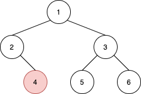
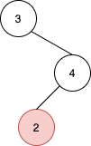

# Find Nearest Right Node in Binary Tree

Given the `root` of a binary tree and a node `u` in the tree, return the nearest node on the same level that is to the right of `u`, or return `null` if `u` is the rightmost node in its level.

## **Example 1:**

```
Input: root = [1,2,3,null,4,5,6], u = 4
Output: 5
Explanation: The nearest node on the same level to the right of node 4 is node 5.
```

## **Example 2:**

```
Input: root = [3,null,4,2], u = 2
Output: null
Explanation: There are no nodes to the right of 2.
```